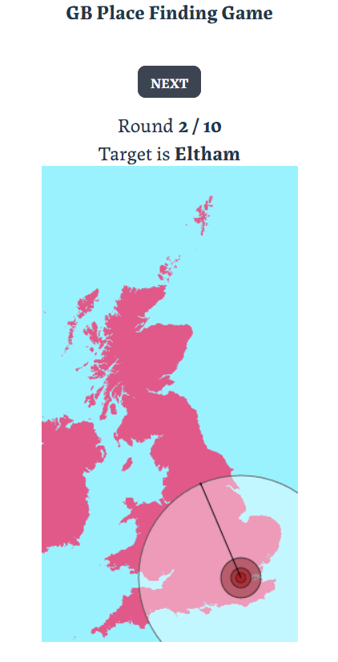

# GB Place Guessing game

A game where you try to guess the location of towns and cities in Great Britain (England, Wales, Scotland)

Using data derived from Ordnance Survey, Crown Copyright and database rights 2023.

- Each game lasts ten rounds.
- Click on the map to make your guess
- A series of rings will show where the town actually is, and where the medal earning zones are

- Click on 'Next' to go to the next round
- If you're close enough, you're awarded medals
  - **Platinum** if within 2 pixels
  - **Gold** if within 5 pixels
  - **Silver** if within 10 pixels
  - **Bronze** if within 20 pixels

There are two high scores recorded,

- **Game score** (based on medals)
  - 200 for each Platinum
  - 100 for each Gold
  - 50 for each Silver
  - 25 for each Bronze
  - 0 for anything else
- **Distance score** (based on total distance you were out by, lower the better)

At the end of the game you can play again, or see a screen showing your stats.
